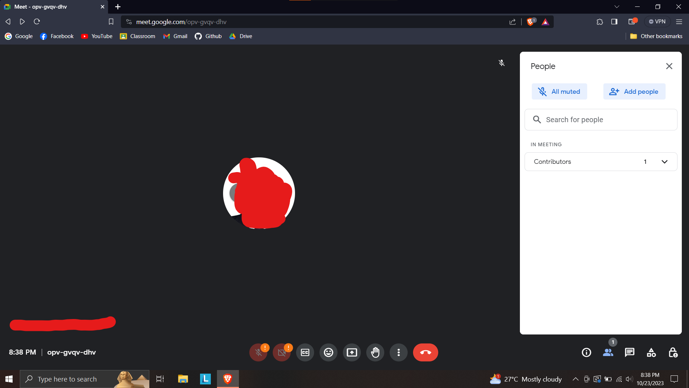

## auto-leave
A python script to auto-leave google meetings.

## Usage
1. Go into a google meeting on your pc
2. Open the people tab on your google meet
3. Your screen should look like below:
   
4. Run the auto-leave program
5. Go back to the google meet and let it run

### Options
```
usage: auto-leave [-h] [-d [DELAY]] [-t [THRESHOLD]] [-f [FREQUENCY]]
example: auto-leave -d 5s -t 10 -f 5min

options:
  -h, --help            show this help message and exit
  -d [DELAY], --delay [DELAY]
                        delay before program start
  -t [THRESHOLD], --threshold [THRESHOLD]
                        the amount before leaving
  -f [FREQUENCY], --frequency [FREQUENCY]
                        how frequent to check the number of people
```

#### Delay
Configurable with the `-d` and `--delay` option. The delay is how long it will wait before starting the program. Useful if the meeting is just starting.

Value accepted can be `5ms` (miliseconds), `5s` (seconds), `5m` (minutes), `5h` (hours) 

Default value is `10s`.

#### Threshold
Configurable with the `-t` and `--threshold` option. The threshold is how many people need to be in the gmeet before it leaves. If the amount of people in the gmeet is lesser than the given threshold, it will trigger the leave button.

Value accepted are numbers greater than `0`.

Default value is `10`.

#### Frequency
Configurable with the `-f` and `--frequency` option. The frequency is the interval between each check of the number of people in the gmeet.

Value accepted can be `5ms` (miliseconds), `5s` (seconds), `5m` (minutes), `5h` (hours) 

Default value is `10`.